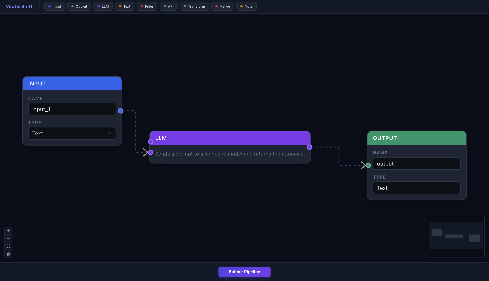
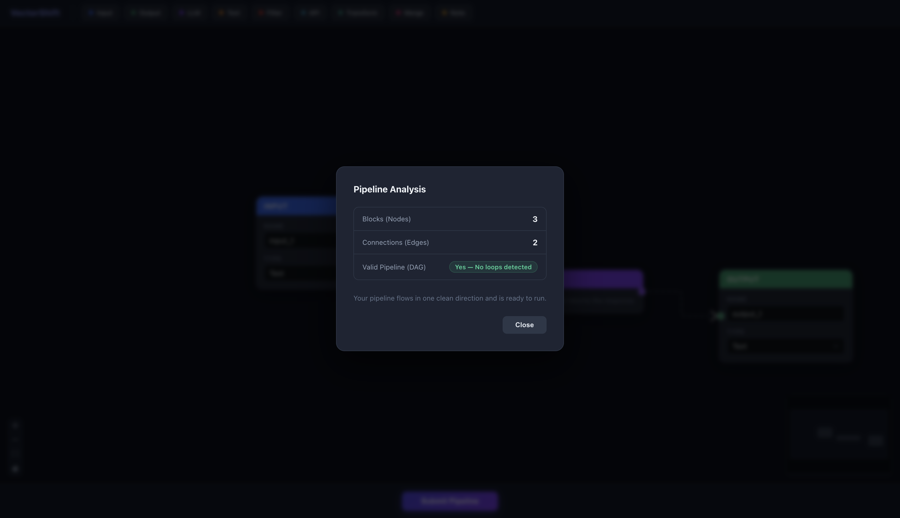
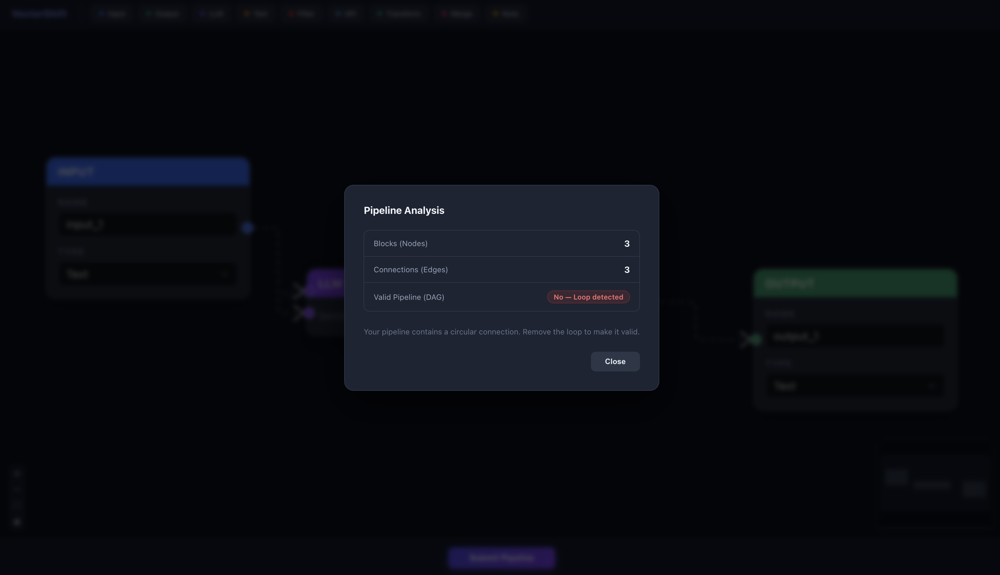

# VectorShift Pipeline Editor

A visual drag-and-drop pipeline builder for designing AI workflows. Drag nodes onto a canvas, connect them with arrows, and submit to validate whether the pipeline is logically correct.

**Live Demo:** [vectorshift-pipeline-editor-tau.vercel.app](https://vectorshift-pipeline-editor-tau.vercel.app)  
**Backend API:** [vectorshift-pipeline-editor.onrender.com](https://vectorshift-pipeline-editor.onrender.com)

---

## Screenshots

### Pipeline Canvas
Drag any of the 9 node types from the toolbar and connect them with arrows.



### Valid Pipeline — No Loop Detected
A clean directional pipeline passes the DAG check.



### Invalid Pipeline — Loop Detected
A circular connection is caught and flagged immediately.



---

## What it does

You drag blocks (nodes) onto a canvas, connect them with arrows to show how data flows, and click Submit. The backend analyzes the pipeline and tells you three things — how many nodes, how many edges, and whether the flow is valid (no loops). If you accidentally create a circular connection, it catches it.

The concept is similar to tools like n8n or LangFlow — you design an AI workflow visually instead of writing code.

---

## Features

- **9 node types** — Input, Output, LLM, Text, Filter, API Request, Transform, Merge, Note
- **Drag and drop canvas** — built on ReactFlow with snap-to-grid
- **Smart Text node** — type `{{variable_name}}` and a new input handle appears automatically for that variable
- **Auto-resize** — Text node height grows as you type more content
- **Pipeline validation** — checks node count, edge count, and DAG validity on submit
- **Loop detection** — DFS-based cycle detection catches circular connections
- **Result modal** — clean popup with valid/invalid status and helpful message
- **Dark theme** — fully styled professional UI

---

## Tech Stack

**Frontend**
- React 18
- ReactFlow 11
- Zustand 4

**Backend**
- Python 3
- FastAPI
- Pydantic

---

## Running locally

You need two terminals.

**Frontend**
```bash
cd frontend
npm install
npm start
```
Opens at `http://localhost:3000`

**Backend**
```bash
cd backend
pip install -r requirements.txt
uvicorn main:app --reload
```
Runs at `http://localhost:8000`

---

## How to use

1. Drag nodes from the toolbar onto the canvas
2. Hover over a node's edge until you see a dot, then drag to another node to connect them
3. Try the **Text node** — type `Hello {{name}}, your order {{id}} is ready` and watch input handles appear for each variable
4. Click **Submit Pipeline** at the bottom
5. A modal shows the node count, edge count, and whether the pipeline is a valid DAG

---

## Node Types

| Node | Inputs | Outputs | Description |
|---|---|---|---|
| Input | — | 1 | Entry point for pipeline data |
| Output | 1 | — | Final destination for the result |
| LLM | 2 (system, prompt) | 1 | Sends prompts to a language model |
| Text | dynamic | 1 | Text with `{{variable}}` placeholders |
| Filter | 1 | 2 (pass, fail) | Routes data based on a condition |
| API Request | 1 | 1 | Makes an HTTP request to an external URL |
| Transform | 1 | 1 | Applies a transformation (uppercase, trim, etc.) |
| Merge | 2 | 1 | Combines two inputs into one output |
| Note | — | — | Sticky note on the canvas, no connections |

---

## API

### `POST /pipelines/parse`

**Request**
```json
{
  "nodes": [{ "id": "customInput-1" }, { "id": "llm-1" }, { "id": "customOutput-1" }],
  "edges": [{ "source": "customInput-1", "target": "llm-1" }, { "source": "llm-1", "target": "customOutput-1" }]
}
```

**Response**
```json
{
  "num_nodes": 3,
  "num_edges": 2,
  "is_dag": true
}
```

`is_dag` is `true` when the pipeline has no circular connections and will execute cleanly from start to finish.

---

## Project Structure

```
frontend_technical_assessment/
├── screenshots/
│   ├── pipeline-canvas.png
│   ├── valid-pipeline.png
│   └── invalid-pipeline.png
├── frontend/
│   └── src/
│       ├── nodes/
│       │   ├── BaseNode.js        ← shared abstraction all nodes extend
│       │   ├── inputNode.js
│       │   ├── outputNode.js
│       │   ├── llmNode.js
│       │   ├── textNode.js        ← auto-resize + {{variable}} handles
│       │   ├── filterNode.js
│       │   ├── apiNode.js
│       │   ├── transformNode.js
│       │   ├── mergeNode.js
│       │   └── noteNode.js
│       ├── App.js
│       ├── ui.js                  ← ReactFlow canvas
│       ├── toolbar.js
│       ├── store.js               ← Zustand state
│       ├── submit.js              ← Submit button + result modal
│       └── index.css              ← dark theme
└── backend/
    ├── main.py                    ← FastAPI + DAG validation logic
    └── requirements.txt
```

---

## Environment Variables

**Backend (Render)**

| Variable | Description |
|---|---|
| `ALLOWED_ORIGINS` | Comma-separated list of allowed frontend URLs |

**Frontend (Vercel)**

| Variable | Description |
|---|---|
| `REACT_APP_API_URL` | URL of the deployed backend |
